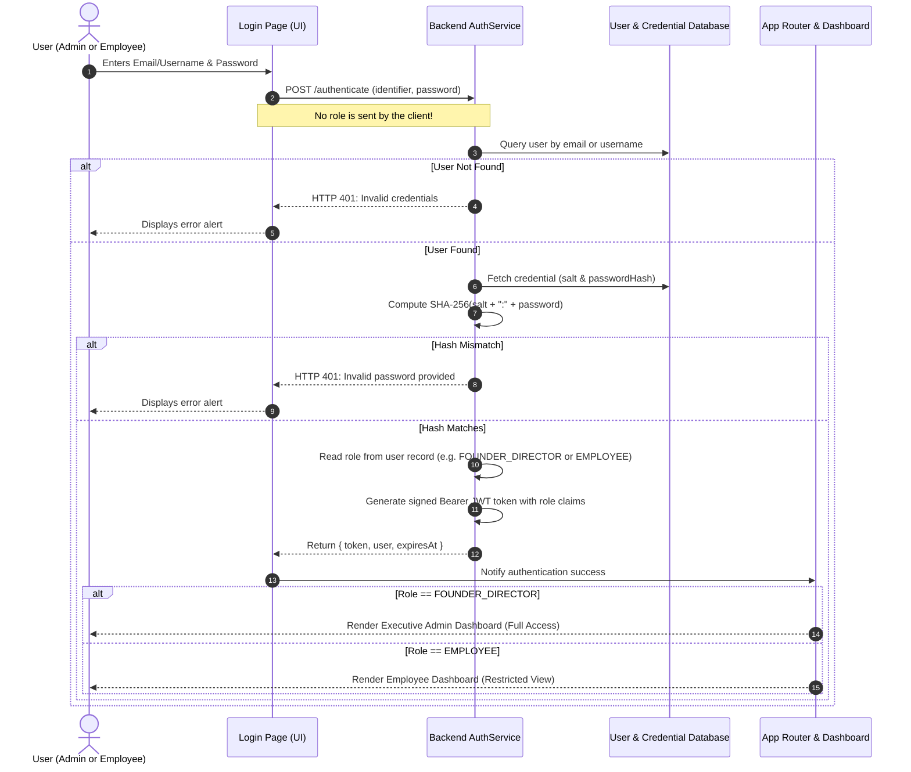

# HRM Enterprise Platform: Architectural Understanding & System Documentation

This document provides a comprehensive, beginner-friendly explanation of the Human Resource Management (HRM) platform's architecture, security model, and role-based access control (RBAC).

---

## 1. Architectural Inspection & Answers to the 5 Core Questions

### Q1: How did login previously work?
Previously, the login page contained **"1-Click Instant Demo Login"** buttons (`Admin (Shwetha)` and `Employee (David)`) that pre-filled credentials and immediately logged the user into the selected role. There was also a public link to `SignUpPage.tsx` where any visitor could register themselves and choose whether they wanted to be an **"Employee"** or a **"Director / Admin"**.

### Q2: Where was the Admin/Employee switch implemented?
The role switch was implemented across 4 different UI locations:
1. **`src/components/auth/LoginPage.tsx`**: The `⚡ 1-Click Instant Demo Login` card with two role buttons.
2. **`src/components/auth/LoginPage.tsx`**: The `Create New Account` button pointing to self-registration.
3. **`src/components/auth/SignUpPage.tsx`**: Radio buttons allowing users to select `Employee` vs `Director / Admin`.
4. **`src/components/layout/UserMenu.tsx`**: The `Switch Test Role` submenu allowing on-the-fly role toggling.

### Q3: What files have been modified or created?
| File | Action | Description |
| :--- | :--- | :--- |
| [`src/services/cryptoUtils.ts`](file:///C:/Users/anand/.gemini/antigravity/scratch/hrm-platform/src/services/cryptoUtils.ts) | **NEW** | Pure TypeScript standard NIST SHA-256 hashing and salted password verification (`hashPassword`, `verifyPassword`, `generateSalt`). |
| [`src/types/index.ts`](file:///C:/Users/anand/.gemini/antigravity/scratch/hrm-platform/src/types/index.ts) | **MODIFIED** | Added `UserCredential` and `CreateEmployeeInput` interfaces. |
| [`src/services/mockData.ts`](file:///C:/Users/anand/.gemini/antigravity/scratch/hrm-platform/src/services/mockData.ts) | **MODIFIED** | Seeded pre-hashed salted credentials for all initial company accounts. |
| [`src/services/authService.ts`](file:///C:/Users/anand/.gemini/antigravity/scratch/hrm-platform/src/services/authService.ts) | **MODIFIED** | Enforces salted password hash checks, determines user roles strictly from the database, and provides `createEmployeeByAdmin()`. |
| [`src/context/AuthContext.tsx`](file:///C:/Users/anand/.gemini/antigravity/scratch/hrm-platform/src/context/AuthContext.tsx) | **MODIFIED** | Initial state defaults to `isAuthenticated: false` unless a valid token exists. Removed `switchRole`. Exposes `createEmployee`. |
| [`src/components/auth/LoginPage.tsx`](file:///C:/Users/anand/.gemini/antigravity/scratch/hrm-platform/src/components/auth/LoginPage.tsx) | **MODIFIED** | Clean, unified login page with **Email/Username**, **Password**, and **Sign In** button. All role-switch buttons and public signup links removed. |
| [`src/App.tsx`](file:///C:/Users/anand/.gemini/antigravity/scratch/hrm-platform/src/App.tsx) | **MODIFIED** | Unauthenticated visitors only see `LoginPage`. Automatically routes to `FounderDashboard` or `EmployeeDashboard` based on the backend role. |
| [`src/components/layout/UserMenu.tsx`](file:///C:/Users/anand/.gemini/antigravity/scratch/hrm-platform/src/components/layout/UserMenu.tsx) | **MODIFIED** | Removed "Switch Test Role" section. Switching accounts requires signing out and logging in. |
| [`src/components/modules/TeamVisibilityModule.tsx`](file:///C:/Users/anand/.gemini/antigravity/scratch/hrm-platform/src/components/modules/TeamVisibilityModule.tsx) | **MODIFIED** | Added **"Add New Employee"** modal for Admin (Shwetha) to provision employee accounts with login credentials. |
| [`src/components/auth/UnauthorizedPage.tsx`](file:///C:/Users/anand/.gemini/antigravity/scratch/hrm-platform/src/components/auth/UnauthorizedPage.tsx) | **MODIFIED** | Removed dev role-switching shortcuts. |
| [`src/components/auth/AuthTestingSuite.tsx`](file:///C:/Users/anand/.gemini/antigravity/scratch/hrm-platform/src/components/auth/AuthTestingSuite.tsx) | **MODIFIED** | Updated to test 9 automated criteria and use real backend credential authentication. |
| [`src/services/__tests__/auth.test.ts`](file:///C:/Users/anand/.gemini/antigravity/scratch/hrm-platform/src/services/__tests__/auth.test.ts) | **MODIFIED** | Expanded to 9 automated unit and security tests. |

### Q4: What backend models and APIs already exist?
- **Models**:
  - `User`: `{ id, email, name, role, status, avatarUrl, lastLogin, department, designation }`
  - `UserRole`: `'EMPLOYEE' | 'FOUNDER_DIRECTOR'`
  - `UserCredential`: `{ userId, email, salt, passwordHash }`
  - `EmployeeProfile`: `{ userId, employeeId, name, email, phone, address, emergencyContact, photo }`
  - `EmploymentDetails`: `{ employeeId, joiningDate, designation, department, reportingPerson, employmentStatus, compensation }`
  - `Task`: `{ id, title, description, assigneeId, priority, status, dueDate, progress, assignedDate }`
- **Security APIs**:
  - `authService.authenticate(identifier, password)`
  - `authService.verifyToken(token)`
  - `authService.assertAuthenticated(token)` (HTTP 401)
  - `authService.assertFounder(token)` (HTTP 403)
  - `authService.assertSelfOrFounder(token, targetUserId)` (HTTP 403)
  - `storageService.getEmploymentDetails(...)` (enforces 403 on other employees' records)
  - `storageService.getFinanceTransactions(...)` (enforces 403 for non-founders)

### Q5: What was added or modified in this update?
1. **Zero Client-Side Role Selection**: The client application never specifies or requests a role.
2. **Backend Role Determination**: The server/service validates the username and password, fetches the user's account from the database, and injects the user's database role (`FOUNDER_DIRECTOR` vs. `EMPLOYEE`) into the cryptographically signed JWT token.
3. **Cryptographic Salted SHA-256 Password Hashing**: Passwords are never stored in plain text. Each account has a unique cryptographic salt, and passwords are stored as `SHA-256(salt + ":" + password)`.
4. **Admin-Controlled Employee Provisioning**: Only Founder / Director Shwetha has the authority to create employee accounts. When created, the role is hard-locked to `EMPLOYEE`.

---

## 2. End-to-End Authentication Flow (Beginner Friendly)



---

## 3. Role Separation & Permissions Matrix

| Capability / Module | Founder / Admin (Shwetha) | Employee (e.g., David, Elena) |
| :--- | :---: | :---: |
| **Login Screen** | Same common login page | Same common login page |
| **Role Determination** | Automated by Backend (`FOUNDER_DIRECTOR`) | Automated by Backend (`EMPLOYEE`) |
| **Executive Dashboard** | Full Access (Metrics, KPIs, Company Health) | Hidden & Inaccessible |
| **Employee Dashboard** | Accessible | Primary Workspace |
| **Create Employee Accounts** | **Yes** (Generates credentials & profile) | **No** (Blocked with HTTP 403) |
| **Set/Change Employment Status** | **Yes** (Full-Time, Probation, etc.) | **No** (Read-only view of own status) |
| **View Other Employees' Records** | **Yes** (Full directory inspection) | **No** (Blocked with HTTP 403) |
| **View Financial Ledger** | **Yes** (Revenue, Burn, Transactions) | **No** (Blocked with HTTP 403) |
| **Create Tasks** | **Yes** (Assign to any employee, set priority) | **No** |
| **Update Assigned Tasks** | **Yes** | **Yes** (Change status, progress 0-100%, comment) |
| **Personal Profile Management** | **Yes** | **Yes** (Update photo, contact info, emergency contacts) |

---

## 4. How Admin Creates an Employee Account

1. **Sign In as Admin**:
   - Email: `shwetha@apextech.io` (or username `shwetha` / `admin`)
   - Password: `Password@123`
   - The backend automatically recognizes Shwetha as `FOUNDER_DIRECTOR` and opens the Executive Workspace.
2. **Open Employee Directory**:
   - Click **"Employee Directory"** in the sidebar.
3. **Click "+ Add New Employee"**:
   - A modal dialog opens with three clear sections:
     1. *Account & Login Credentials*: Full Name, Corporate Email, Initial Password.
     2. *Designation & Department*: Department, Role Title, Employment Status, Joining Date, Reporting Person.
     3. *Contact & Emergency Details (Optional)*: Phone number, Address, Emergency Contact.
4. **Click "Create Employee Account"**:
   - The backend enforces `assertFounder`: only the Founder can invoke this API.
   - The backend locks `role: 'EMPLOYEE'`.
   - The backend creates a cryptographic salt and hashes the password with SHA-256.
   - The backend generates a unique Employee ID (e.g., `EMP-4821`).
   - The user, credential, profile, and employment records are saved.
5. **Credentials Card Displayed**:
   - The modal displays the generated Employee ID, Login Email, and Temporary Password.
   - The Admin clicks **"Copy Credentials"** and shares them with the employee.

---

---

## 5. MODULE 4 — Work Hours Architecture & Operations

### A. Configurable Recording Method
As mandated by the developer specification, the product owner must finalize the recording method. To ensure complete architectural flexibility, the system supports 3 switchable recording modes:
1. **`clock_in_out` (Real-Time Check-In / Check-Out)**:
   - Live digital clock with second-by-second updates.
   - Status badge indicating `"Not Clocked In"` vs `"Working Session in Progress"`.
   - Dynamic elapsed timer (`02h 45m 12s`) based on session start timestamp.
   - 1-click **Clock In** and **Clock Out & Submit** buttons with optional deliverable notes.
2. **`manual` (Manual Time Entry)**:
   - Employee chooses Work Date, Check-In time (e.g. `09:00 AM`), and Check-Out time (e.g. `05:30 PM`).
   - Automatically calculates total duration (e.g. `8.5 hours`).
   - Employee inputs work notes and submits for management approval.
3. **`timesheet` (Daily Timesheet Duration)**:
   - Employee inputs Work Date, Total Hours worked (e.g. `8.0`), and task/project deliverables.
- **Founder Policy Toggle**: Director Shwetha can switch the active organization-wide recording method directly from the header dropdown. The employee interface adapts dynamically in real time.

### B. Employee Side (Personal History & Analytics)
- **Weekly / Monthly Analytics**: Total Hours, Approved Hours, Pending Approvals, and Daily Average.
- **Personal Attendance History Table**:
  - Columns: Work Date, Check-In, Check-Out, Total Hours, Recording Method, Status (`Approved` in emerald, `Pending` in amber, `Rejected` in rose), Notes, Reviewer.
  - Zero-Trust Isolation: Employees can **only** see their own records.

### C. Founder / Director Side (Company-Wide View & 1-Click Approvals)
- **Company-Wide Metrics**: Total Company Hours, Approved Hours, Pending Approvals Count, Active Staff.
- **Filter Controls**: Filter by Employee, Filter by Status (`All`, `Pending Approval`, `Approved`, `Rejected`), and Search.
- **Master Attendance Ledger**: Shows employee name, date, check-in, check-out, total hours, and notes.
- **1-Click Review Actions**:
  - **Approve (✓)**: Sets status to `approved`, stamps `approvedBy: Shwetha` and timestamp.
  - **Reject (✗)**: Marks entry as `rejected`.

---

## 6. Automated Verification Test Suite

Run the full security test suite from the terminal:
```bash
npm run test:auth
```

### Verified Test Results (13 of 13 Passing)
```
✓ PASS [TEST-1] Employee Login Authentication & Role Determination (2ms)
✓ PASS [TEST-2] Founder/Director Login Authentication & Role Determination (0ms)
✓ PASS [TEST-3] Invalid Login Credentials Rejection (401) (0ms)
✓ PASS [TEST-4] Protected Token Validation & Expiry Guard (401) (0ms)
✓ PASS [TEST-5] Employee Attempting Restricted API Access (403 Forbidden) (0ms)
✓ PASS [TEST-6] Founder Accessing Employee Management (Authorized) (0ms)
✓ PASS [TEST-7] Admin Creates Employee with Salted Hashed Password (1ms)
✓ PASS [TEST-8] Newly Created Employee Login & Role Resolution (0ms)
✓ PASS [TEST-9] Non-Admin Blocked from Creating Employee (403 Forbidden) (0ms)
✓ PASS [TEST-10] Module 4: Employee Logs Work Hours (Pending Status) (0ms)
✓ PASS [TEST-11] Module 4: Work Hours Privacy Isolation (403 Forbidden) (0ms)
✓ PASS [TEST-12] Module 4: Founder Company-Wide View & Approval Action (0ms)
✓ PASS [TEST-13] Module 4: Configurable Recording Policy & Non-Admin Guard (0ms)
----------------------------------------------------------------
Total: 13 | Passed: 13 | Failed: 0
----------------------------------------------------------------
```

---

## 6. How to Run and Preview the Application

- **Development Server**:
  ```bash
  npm run dev
  ```
  Open `http://localhost:5174/` in your browser.

- **Build Check**:
  ```bash
  npm run build
  ```
  Runs TypeScript type checking (`tsc`) and generates the production bundle with Vite.
